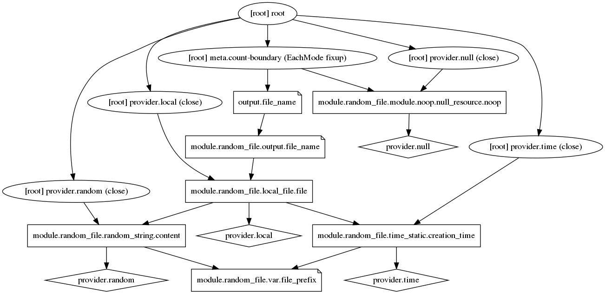
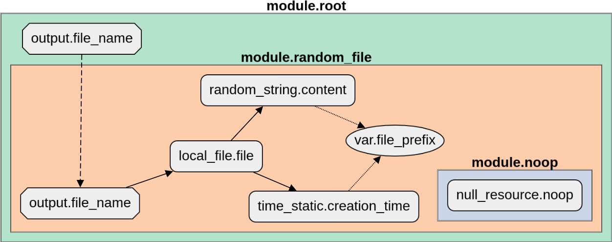

# Terraform graph beautifier

Command line tool allowing to convert the barely usable output of the `terraform graph` command to something more meaningful and explanatory.

| `terraform graph` raw output | Cytoscape.js output |
| :-: | :-: |
|  |  |


# Installation
```bash
go get github.com/pcasteran/terraform-graph-beautifier
```

Basic usage:
```bash
cd ${GOPATH}/src/github.com/pcasteran/terraform-graph-beautifier/samples/config1/
terraform init

terraform graph | terraform-graph-beautifier \
    -exclude="module.root.provider" \
    -output-type=cyto-html \
    > config1.html
```

## Input and outputs
The command works by parsing the Graphviz [Dot](https://www.graphviz.org/doc/info/lang.html) script generated by `terraform graph` from the standard input (or specified file) and produces one of the following output types on the standard output (or file):
- an HTML page using [Cytoscape.js](https://js.cytoscape.org/) to render the graph of the Terraform configuration elements and their dependencies
- a JSON document in the Cytoscape.js [format](https://js.cytoscape.org/#notation/elements-json) containing the graph elements and their dependencies
- a cleaned and prettier Dot script that can be piped to a Graphviz [rendering command](https://linux.die.net/man/1/dot).

## Input graph loading and processing
The loading of the input graph involves the following steps:
1. **Cleaning**
   1. Renaming the nodes using a more consistent pattern : `[root] rsc_type.rsc_name` => `module.root.rsc_type.rsc_name`.
   1. Using the `'` character instead of `"` in map keys : `buckets["artefacts"]` => `buckets['artefacts']`
   1. Removing the nodes and edges generated by Terraform but not corresponding to configuration elements (aka TF junk). This can be deactivated via a command line switch.
1. **Filtering**
   - Using user-provided pattern(s) to exclude some elements (resource, var, module, provider, ...) from the output.
   - These patterns are [Go regexp](https://golang.org/pkg/regexp/) and are matched line by line against the output of the **cleaning** step, so use the `"root.rsc_type.rsc_name"` naming. 

## HTML output templating
The command uses Go [HTML templates](https://golang.org/pkg/html/template/) to create the HTML output.

## Static assets management
The static assets (HTML templates, ...) are embedded in the binary using [pkger](https://github.com/markbates/pkger).
The generated `pkged.go` file is checked-in in order for the repository to be "go-gettable".

In development mode, when working on the templates for example, you don't want to launch the `pkged.go` generation process every time you modify an asset file; instead you would prefer using the current version of the file.
To do this, simply configure your IDE to use the build tag `skippkger`.
